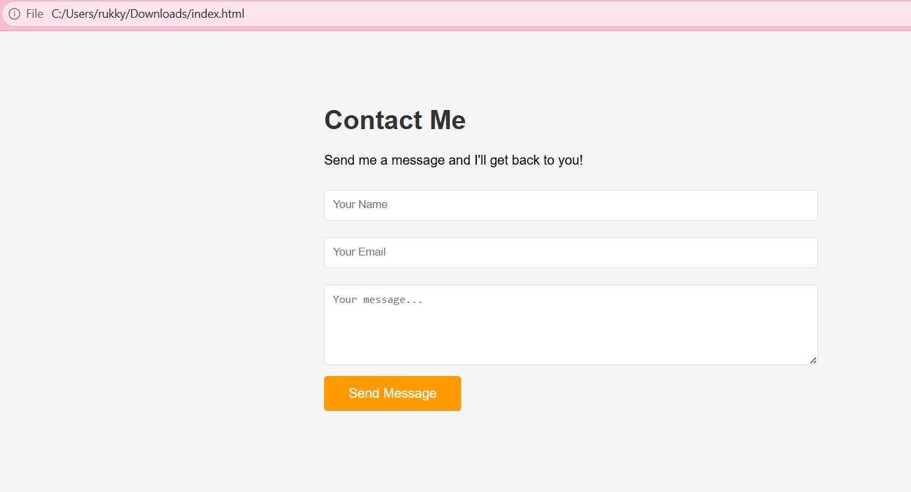
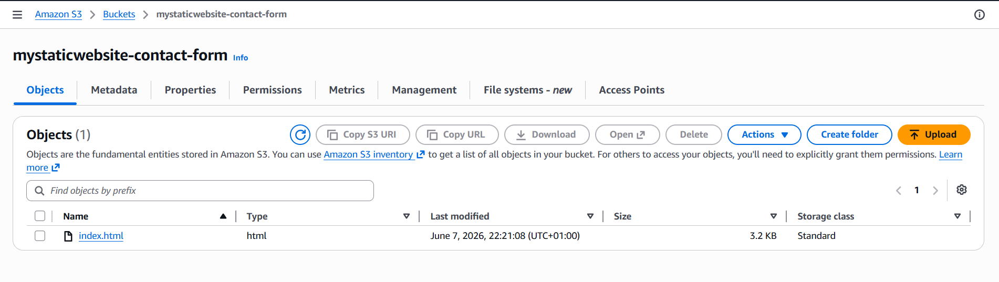
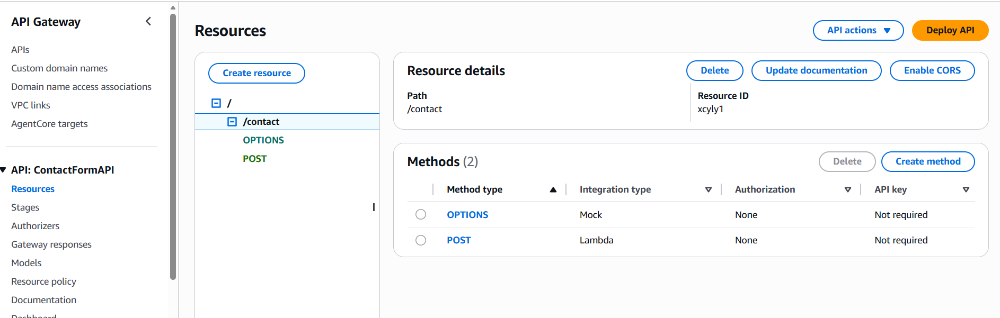
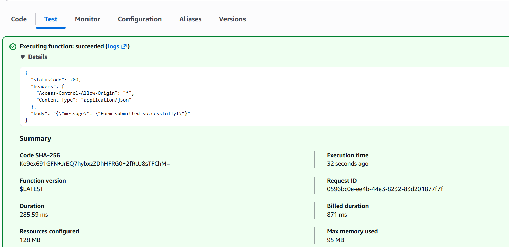
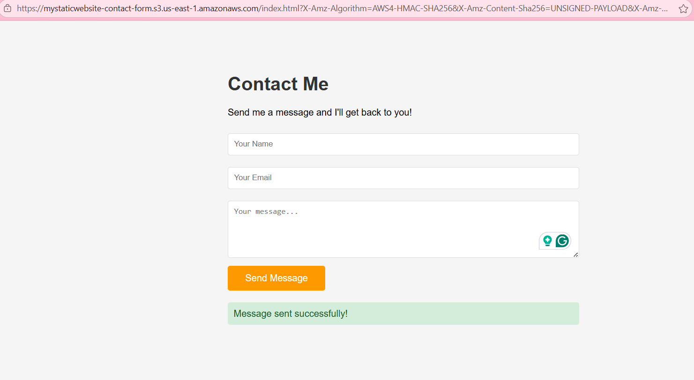
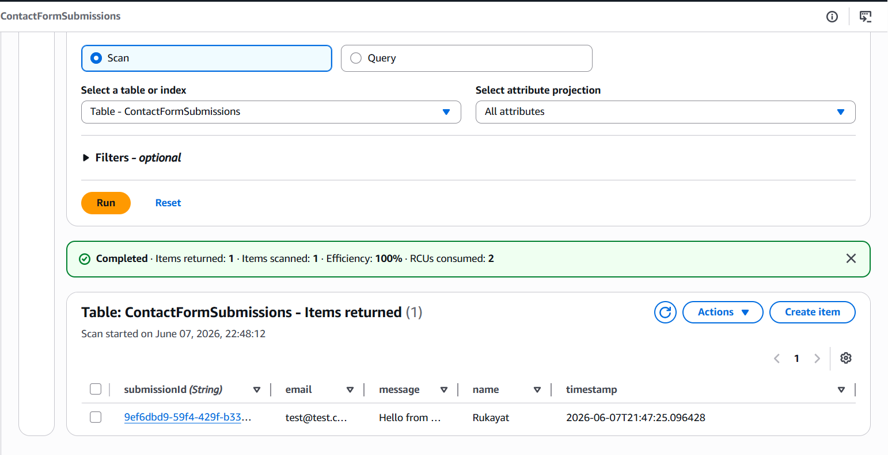
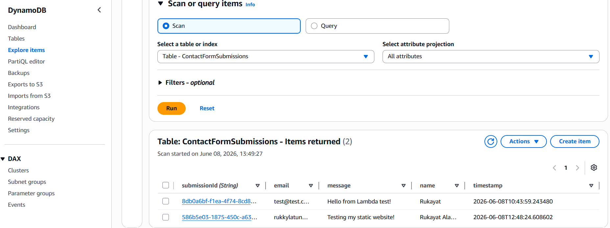

# serverless-contact-form-aws

> A fully serverless contact form built end-to-end on AWS free-tier services. A static HTML page hosted on S3 collects user messages and sends them via API Gateway to a Lambda function, which stores each submission in DynamoDB — zero servers, zero maintenance, zero cost for personal use.


---

## Architecture

```
Browser  ──HTTPS POST──►  API Gateway (/contact)  ──Trigger──►  Lambda  ──PutItem──►  DynamoDB
   ▲                              │                                  │
   │                    (CORS enabled)                        (uuid + timestamp)
   └──────────────── 200 OK "Message sent successfully!" ◄──────────┘
```

**Services used:**

| Service | Role |
|---|---|
| Amazon S3 | Hosts the static `index.html` contact form |
| Amazon API Gateway | Exposes a REST endpoint `POST /contact` |
| AWS Lambda | Processes form data, generates submission ID |
| Amazon DynamoDB | Stores submissions (name, email, message, timestamp) |

---

## Project Structure

```
.
├── index.html          # Contact form frontend (uploaded to S3)
├── lambda_function.py  # Lambda handler (Python)
└── README.md
```

---

## How It Works

1. **S3** serves `index.html` as a static website with a contact form (Name, Email, Message).
2. On submit, JavaScript sends a `POST` request to the **API Gateway** endpoint.
3. **API Gateway** triggers the **Lambda** function with the request body.
4. **Lambda** parses the JSON, generates a UUID, and writes the item to **DynamoDB**.
5. Lambda returns `200 OK` with `{"message": "Form submitted successfully!"}`.
6. The frontend displays a green success banner to the user.

---

## DynamoDB Schema

**Table name:** `ContactFormSubmissions`  
**Partition key:** `submissionId` (String)

| Attribute | Type | Example |
|---|---|---|
| `submissionId` | String | `9ef6dbd9-59f4-429f-b33...` |
| `name` | String | `Rukayat` |
| `email` | String | `test@test.com` |
| `message` | String | `Hello from Lambda test!` |
| `timestamp` | String | `2026-06-08T10:43:59.243480` |

---

## Setup Guide

### Prerequisites
- AWS account (free tier is sufficient)
- Basic familiarity with the AWS console

### Step 1 — DynamoDB
1. Go to **DynamoDB → Tables → Create table**
2. Table name: `ContactFormSubmissions`
3. Partition key: `submissionId` (String)
4. Leave all other settings as default → **Create**

### Step 2 — Lambda
1. Go to **Lambda → Create function**
2. Author from scratch, Runtime: **Python 3.x**
3. Paste the code from `lambda_function.py`
4. Add an **IAM permission** to the Lambda execution role: `dynamodb:PutItem` on your table
5. **Deploy** and run the test — you should see `statusCode: 200`

### Step 3 — API Gateway
1. Go to **API Gateway → Create API → REST API**
2. Create resource: `/contact`
3. Enable **CORS** on the resource
4. Create method: `POST` → Integration type: **Lambda** → select your function
5. **Deploy API** to a stage (e.g. `prod`)
6. Copy the **Invoke URL** (e.g. `https://xxxx.execute-api.us-east-1.amazonaws.com/prod/contact`)

### Step 4 — Frontend (S3)
1. Open `index.html` and replace the `API_URL` variable with your API Gateway invoke URL
2. Go to **S3 → Create bucket**
3. Uncheck "Block all public access"
4. Enable **Static website hosting** under Properties
5. Add a **Bucket policy** to allow public `GetObject`
6. Upload `index.html`
7. Open the S3 website URL to test the live form

---

## Lambda Function

```python
import json
import boto3
import uuid
from datetime import datetime

dynamodb = boto3.resource('dynamodb')
table = dynamodb.Table('ContactFormSubmissions')

def lambda_handler(event, context):
    body = json.loads(event['body'])
    
    table.put_item(Item={
        'submissionId': str(uuid.uuid4()),
        'name':         body['name'],
        'email':        body['email'],
        'message':      body['message'],
        'timestamp':    datetime.utcnow().isoformat()
    })
    
    return {
        'statusCode': 200,
        'headers': {
            'Access-Control-Allow-Origin': '*',
            'Content-Type': 'application/json'
        },
        'body': json.dumps({'message': 'Form submitted successfully!'})
    }
```

---

## Screenshots

### Contact Form (Local)


### Uploaded to S3 & Live


### API Gateway — /contact Resource


### Lambda Test — Success


### Successful Form Submission


### DynamoDB — First Submission


### DynamoDB — Multiple Submissions


---

## What I Learned

- How to connect AWS services end-to-end without managing any servers
- Setting up CORS correctly between S3, API Gateway, and Lambda
- Storing structured data in DynamoDB with a UUID partition key
- Hosting a static website on S3 with public access

---

## Cost

This project runs entirely within the **AWS Free Tier**:
- S3: 5 GB storage, 20,000 GET requests/month free
- API Gateway: 1 million REST API calls/month free
- Lambda: 1 million requests/month free
- DynamoDB: 25 GB storage, 25 WCU/RCU free

**Estimated cost for personal use: $0.00/month**

---

*Built by Rukayat · June 2026*
